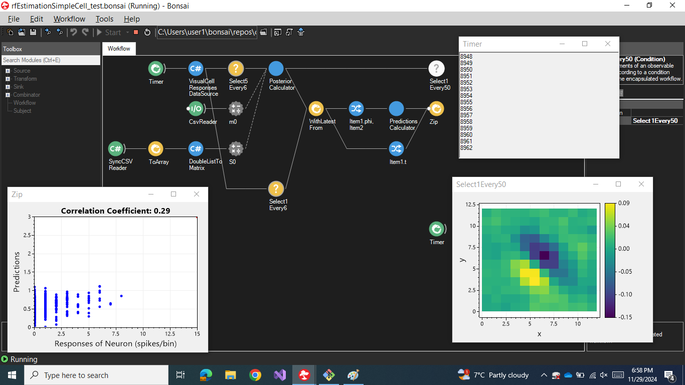

# Repository demonstrating the use of **online Bayesian linear regression** to estimate the receptive field of a cortical simple cell

The following workflow demonstrates the use of **online Bayesian linear
regression** to estimate the receptive field of a visual simple cell recorded
from the primary visual cortex of an anesthetized cat.

## Experimental procedure

Experimental details can be found at

> Felsen G, Touryan J, Han F, Dan Y. Cortical sensitivity to visual features in natural scenes. PLoS Biol. 2005 Oct;3(10):e342. doi: 10.1371/journal.pbio.0030342. Epub 2005 Sep 27. PMID: 16171408; PMCID: PMC1233414.

Briefly, cat visual neurons were stimulated with natural images, and pairs of
images and responses were saved.

These pairs were then used to estimate spike-trigered covariance features,
which were subsecquentlty utilized to build quasi-random images, matched to the
previous natural images.

The random images were presented to the same visual neuron that has previously
stimulated with naturla stimuli.

## Installation instructions

To run this demo:

1. clone this repository
2. execute `bonsai-oblr-corticalSimpleCellEx/.bonsai/Setup.cmd`
3. run `bonsai-oblr-corticalSimpleCellEx.bonsai/Bonsai.exe`
4. in Bonsai open the workflow `bonsai-oblr-corticalSimpleCellEx/package/rfEstimationSimpleCell.bonsai`
5. download un unzip the [data file](https://www.gatsby.ucl.ac.uk/~rapela/bonsai/onlineBayesianLinearRegression/data/simpleCellData.zip)
6. set the properties `imagesFilename` and `responsesFilename` of  the node
   `Visual Cell Responses Data Source` to point to `naturalImages.dat` and
   `naturalSpikesRates.dat` (or `randomImages.dat` and `randomSpikesRates.dat`)
   dowloaded above.
7. press the `Start` button in Bonsai

## Relevant source code

- [VisualCellResponsesDataSource](package/Extension/VisualCellResponsesDataSource.cs)

- [PosteriorCalculator](https://github.com/joacorapela/bonsai-Bonsai.ML-OnlineBayesianLinearRegression/blob/master/code/src/PosteriorCalculator.cs)
- [BayesianLinearRegression.OnlineUpdate](https://github.com/joacorapela/bayesianLinearRegressionCSharp/blob/master/code/src/bayesianLinearRegression/BayesianLinearRegression.cs#L6)

