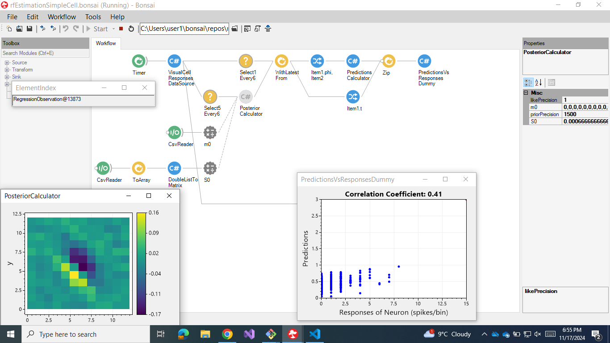

# Repository demonstrating the use of **online Bayesian linear regression** to estimate the receptive field of a cortical simple cell

The following workflow demonstrates the use of **online Bayesian linear
regression** to estimate the receptive field of a visual simple cell recorded
from the primary visual cortex of an anesthetized cat.

## Experimental procedure

Experimental details can be found at

> Felsen G, Touryan J, Han F, Dan Y. Cortical sensitivity to visual features in natural scenes. PLoS Biol. 2005 Oct;3(10):e342. doi: 10.1371/journal.pbio.0030342. Epub 2005 Sep 27. PMID: 16171408; PMCID: PMC1233414.

Briefly, cat visual neurons were stimulated with natural images, and pairs of
images and responses were saved.

These pairs were then used to estimate spike-trigered covariance features,
which were subsecquentlty utilized to build quasi-random images, matched to the
previous natural images.

The random images were presented to the same visual neuron that has previously
stimulated with naturla stimuli.

## Installation instructions

To run the current demonstration:

1. `git clone https://github.com/joacorapela/bonsai-onlineBayesianMultivariateLinearRegression.git`

2. download the files

    - [natural images](https://www.gatsby.ucl.ac.uk/~rapela/bonsai/onlineBayesianLinearRegression/data/equalpower_C2_25hzPP.dat),
    - [natural responses](https://www.gatsby.ucl.ac.uk/~rapela/bonsai/onlineBayesianLinearRegression/data/nsSumSpikeRates.dat),
    - [random images](https://www.gatsby.ucl.ac.uk/~rapela/bonsai/onlineBayesianLinearRegression/data/rsImagesC2PP.dat),
    - [random responses](https://www.gatsby.ucl.ac.uk/~rapela/bonsai/onlineBayesianLinearRegression/data/rsSumSpikeRates.dat),

    and save them to the directory `bonsai-onlineBayesianMultivariateLinearRegression\Extensions\data`

3. set the properties `imagesFilename` and `responsesFilename` of  the node
   `Visual Cell Responses Data Source` to point to the natural images and
   natural responses filenames (or random images and random responses)
   dowloaded above.
